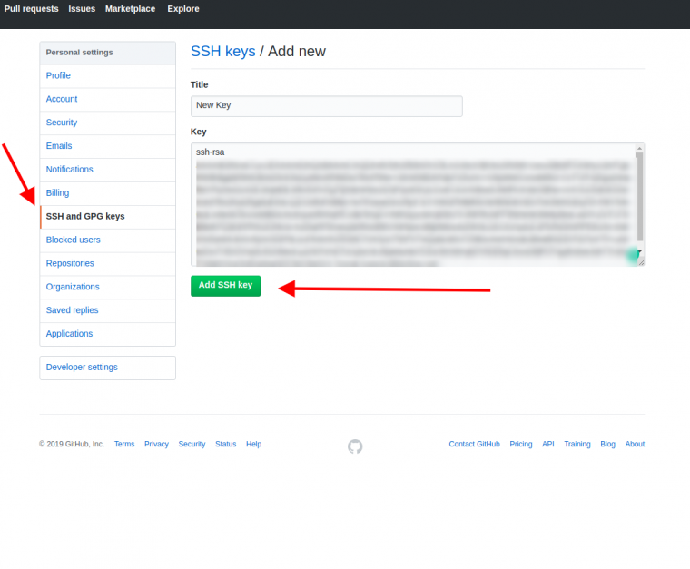

# このリポジトリについて

このリポジトリはウェブサイトから情報を収集するために利用するスクレイピングツールです

## ※警告※

スクレイピングツール自体は違法ではありませんが、次のことを考慮してください

- 会員制のWebサイトなど、スクレイピングを禁止する規約を制定している場合
- スクレイピング時のサーバー負荷
- 著作権侵害


## 動作環境

OS : Ubuntu22.04.5 Desktop LTS
Git Version : 2.34.1
UV : 0.8.4


## GitHub リポジトリスクレイピング

### 概要

指定した GitHub ユーザーまたは組織のリポジトリ一覧を取得し、名前・フルネーム・説明に特定の文字列（または正規表現）が含まれるものを、最低 10 秒間隔で自動的に clone します

### 初期設定

#### Gitインストール

```bash
# パッケージのインストール
sudo apt-get install git

# ユーザー名の設定
git config --global user.name 'YOURE-NAME'

# メール設定
git config --global user.email 'YOURE-EMAIL'
```

#### 公開鍵の作成

```bash
# rsa鍵の作成
ssh-keygen -t rsa -f ~/.ssh/id_rsa

# rsa公開鍵を取得
cat ~/.ssh/id_rsa.pub
```

#### 公開鍵登録




#### アクセス確認

```bash
# SSH接続テスト
ssh -T git@github.com
```

#### uvインストール

```bash
# uvをインストール
curl -LsSf https://astral.sh/uv/install.sh | sh

# バージョン確認
uv --version
```

### 使い方

環境同期

```bash
# ディレクトリ移動
cd web-scraping/

# 環境同期
uv sync
```

利用例

```bash
# 例: ユーザー octocat のリポジトリから "sample" を含むものを 10 秒間隔で clone
uv run ./src/github-scraping.py --user octocat --match sample --dest ./repos --interval 10

# 例: 組織 my-org のリポジトリ名に正規表現でマッチするものを clone
python3 ./src/github-scraping.py --org my-org --regex "^data-.*" --dest ./repos

# 既に存在する場合は pull で更新したい
python3 ./src/github-scraping.py --user octocat --match sample --pull-if-exists
```

利用可能な実行オプション

- `--user` または `--org` のどちらか必須
- `--match` 文字列で部分一致（名前・フルネーム・説明が対象）
- `--regex` 正規表現でマッチ（`--match` より優先）
- `--dest` clone 先ディレクトリ（既定: `./repos`）
- `--interval` 各 clone 間隔秒（10 秒未満は拒否。既定: 10）
- `--include-archived` アーカイブ済みも対象
- `--pull-if-exists` 既存なら clone ではなく `git pull --ff-only`
- `--sleep-on-skip` 既存でスキップした場合でも間隔スリープ

### 注意
- GitHub API のレート制限に達した場合は自動で解除時刻まで待機します。
- fork の除外指定は API の追加呼び出しが必要になるため、現状は含めたまま（既定）です。必要であれば拡張してください。

## arxiv　論文スクレイピング

指定した任意の検索クエリに該当する論文をarxiv apiを利用してダウンロードします

### 使い方

```bash
# 基本的な使用方法
python src/arxiv-scraping.py "machine learning transformer"

# 最大5件の論文をダウンロード
python src/arxiv-scraping.py "deep learning" --max-results 5

# カスタムディレクトリに保存
python src/arxiv-scraping.py "neural networks" --output-dir "my_papers"

# 最新の論文から順にダウンロード
python src/arxiv-scraping.py "computer vision" --sort-by lastUpdatedDate

# 複数オプションを組み合わせ
python src/arxiv-scraping.py "natural language processing" -n 15 -o "nlp_papers" --sort-by submittedDate --sort-order ascending
```

利用可能な実行オプション

- `--max-results` (`-n`) ダウンロードする論文の最大数（既定: 10）
- `--output-dir` (`-o`) 論文を保存するディレクトリ（既定: arxiv_papers）
- `--sort-by` ソート基準 (relevance, lastUpdatedDate, submittedDate)（既定: relevance）
- `--sort-order` ソート順序 (ascending, descending)（既定: descending）
- `--help` (`-h`) ヘルプメッセージを表示
